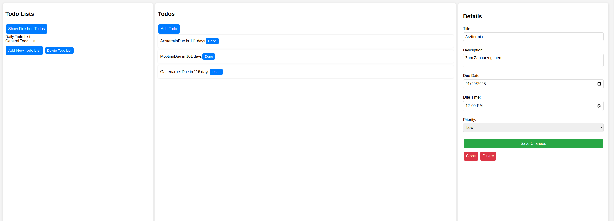

# ✅ Todo List Application

This project is part of **The Odin Project's JavaScript curriculum**, where I developed a dynamic **Todo List** application using **JavaScript**, **HTML**, and **CSS**. The goal of the project was to practice working with **objects**, **factories**, and **modules** in JavaScript while creating a functional and organized to-do list.

## 🌟 Features

- Add, edit, and delete tasks to keep track of to-dos.
- Organize tasks by different **projects** or categories.
- Set **due dates** and mark tasks as complete.
- All tasks are stored locally using the **browser's localStorage**.
- A clean and intuitive user interface designed with **CSS** for easy navigation.

## 🚀 Technologies Used

- **HTML5**: For structuring the webpage.
- **CSS3**: For designing the layout and styling of the app.
- **JavaScript (ES6)**: For creating and managing tasks and projects, as well as handling user interactions.
- **Webpack**: For bundling JavaScript modules and managing project assets.
- **localStorage**: To store tasks persistently in the browser.

## 📸 Preview

You can view the Todo List application here: [Live Demo](https://mrswizzer.github.io/odin-todo-list)

## 💡 Learning Outcomes

Through this project, I improved my understanding of:

- Structuring JavaScript code using **classes** and **modules**.
- **DOM manipulation** for dynamically rendering the todo list and its tasks.
- Implementing **localStorage** for persistent data storage in the browser.
- Using **Webpack** to bundle and organize code efficiently.
- Building a user-friendly and organized **UI** with **CSS**.

---

## 🔗 Acknowledgments

This project was created as part of [The Odin Project](https://www.theodinproject.com/)'s curriculum.
